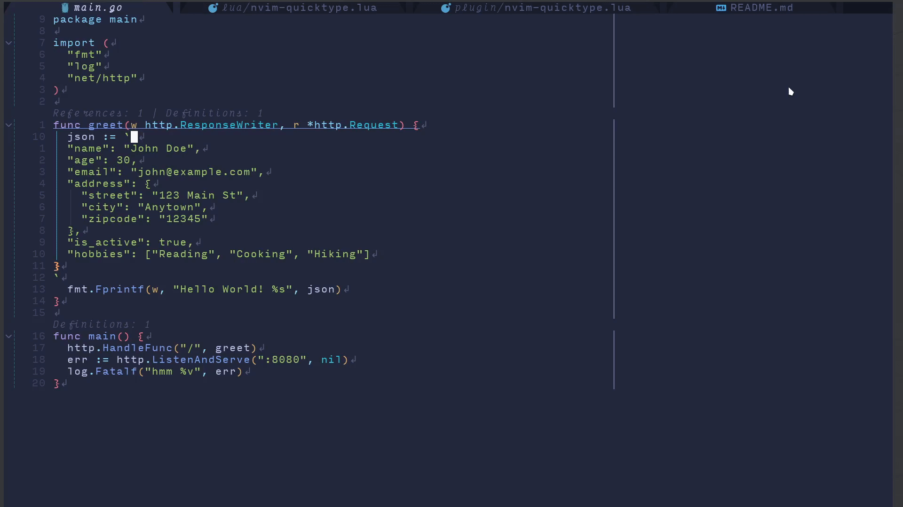

# Nvim-Quicktype

A Neovim plugin for creating types in a multitude of languages based from a JSON in the clipboard.

Same behavior as this [VS Code plugin](https://github.com/glideapps/quicktype-vscode).

You have a JSON in the clipboard `"+` register, and you get prompted for the top-level type name.

Then you'll get the newly generated type inserted at the cursor position.

Here is it in practice :

